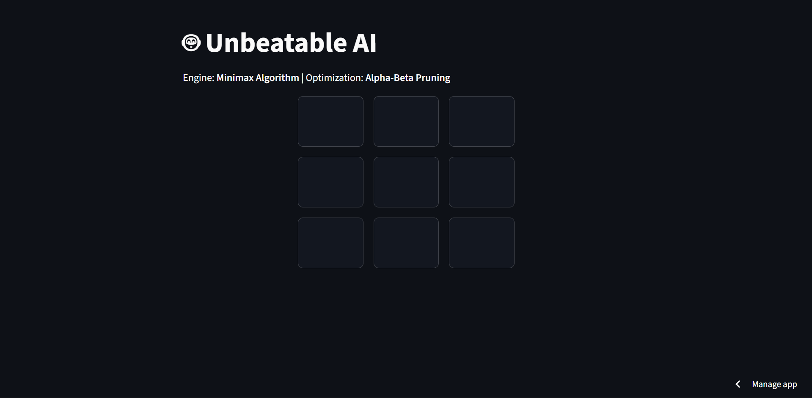

# 🤖 Unbeatable AI Game Engine

[](https://unbeatable-engine.streamlit.app)


A deterministic, zero-sum game engine built in Python that utilizes the **Minimax Algorithm** with **Alpha-Beta Pruning** to create a mathematically unbeatable Tic-Tac-Toe agent.

**[🎮 Play the Live Demo Here](https://unbeatable-engine.streamlit.app)**

---

## 🚀 Key Features

* **Perfect Play:** The AI traverses the game tree to evaluate all possible future states, ensuring it never loses. The best outcome for a human player is a Draw.
* **Optimized Performance:** Implements **Alpha-Beta Pruning** to cut off sub-optimal branches in the search tree, significantly reducing computational overhead.
* **Modular Architecture:** Decouples the **Game Logic (Model)** from the **UI (View)**, following software engineering best practices.
* **State-Aware UI:** Built with **Streamlit** to handle session state preservation and reactive updates without page reloads.

---

## 🧠 Technical Implementation

### The Minimax Algorithm
The engine treats the game as a recursive tree of possibilities:
* **Maximizing Player (AI):** Seeks to maximize the score (+10 for a win).
* **Minimizing Player (Human):** The AI assumes the human will play perfectly to minimize the score (-10 for a human win).

### Complexity Analysis
* **Time Complexity:** The standard Minimax algorithm operates in $O(b^d)$, where $b$ is the branching factor (available moves) and $d$ is the depth (turns left).
* **Optimization:** With Alpha-Beta Pruning, the effective branching factor is reduced, bringing the average complexity closer to $O(b^{d/2})$. This allows the engine to make decisions in milliseconds.

---

## 🛠️ Installation & Local Setup

If you want to run this engine locally:

1.  **Clone the repository**
    ```bash
    git clone https://github.com/Nikhilesh-0/unbeatable-ai-engine.git
    cd unbeatable-ai-engine
    ```

2.  **Install dependencies**
    ```bash
    pip install -r requirements.txt
    ```

3.  **Run the application**
    ```bash
    streamlit run app.py
    ```

---

## 📂 Project Structure

```text
unbeatable-ai-engine/
├── app.py              # The Streamlit frontend and UI logic
├── game_engine.py      # Core Tic-Tac-Toe Class and Minimax Logic
├── requirements.txt    # Dependencies (streamlit)
└── README.md           # Documentation
